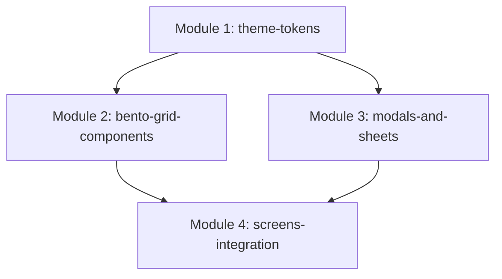

# SPEC: Aura Pregnancy 4-Layer Hybrid UI Architecture
**Versiyon:** 1.0.0  
**Tarih:** 2026-09-02  
**Durum:** Onaylandı / Uygulama Aşaması  
**Yöntem:** Spec-Driven Development (SDD)

---

## 1. Vizyon & Amaç (Vision & Goals)

Aura Pregnancy uygulamasını piyasadaki sıradan, düz ve tekdüze hamilelik uygulamalarından ayrıştırarak; anne adayına huzur, lüks, güven ve dokunsal tatmin veren, dünya standartlarında **4 Katmanlı Hibrit UI Mimarisi** ile donatmaktır.

Bu mimari, saf mat kilin boğucu olmasını engellerken, saf camın soğukluğunu kırar; porselen sıcaklığında difüze ışıklar ve asimetrik Bento-Grid düzenleri ile nefes alan uzamsal bir deneyim sunar.

---

## 2. Dört Katmanlı Hibrit Mimari Matrisi (The 4-Layer Matrix)

| Katman | Katman Adı | Uygulanan Tasarım Stili | Görsel & Teknik Karşılığı |
|---|---|---|---|
| **Katman 1** | **Arka Plan & Atmosfer** | Ambient Warm Minimalist | İki tonlu sıcak porselen degrade (`#FFFDFC` → `#FDF1EB`) + köşelerde difüze pastel ortam ışıkları (`AmbientBackground`). |
| **Katman 2** | **Büyük Bilgi Kartları & Modallar** | Liquid Glass (Buzlu Cam) | `%85-%92` opaklık, mikro beyaz porselen yansıma kenarlığı (`Border.all(white, 1.2)`), `BackdropFilter(sigma: 16-18)` ile arka planı buğulayan ferah zemin (`ClayCard(isGlazed: true)`). |
| **Katman 3** | **Butonlar, Sayaçlar & Aksiyonlar** | Claymorphism 3.0 (Sırlı Porselen Kil) | Hacimli yüzey renk geçişi (Volume Gradient - HSL hafiflik farkı), üst parlama ışığı (Specular highlight), çift iç gölge (`inset`), dış gölge, `AnimatedScale(0.955)` ve `HapticFeedback` dokunsal geri bildirim. |
| **Katman 4** | **Veri & Metin Düzeni** | Bento-Grid & Modern Editorial | Asimetrik 2x1, 1x2, 2x2 bilgi blokları; hiyerarşik `GoogleFonts.outfit` (Başlıklar / Sayaçlar - 800/900) ve `GoogleFonts.plusJakartaSans` (Gövde / Tıbbi Açıklamalar - 500/600/700); yüksek kontrastlı kömür-mürdüm metin rengi (`#231B24`). |

---

## 3. Modül Haritası & Sorumluluklar (Capability Map)



| Modül ID | Sorumluluk Alanı | Bağımlılıklar |
|---|---|---|
| `theme-tokens` | Renk paleti, `glazedGlassDecoration`, `clayButtonDecoration`, `Outfit` & `Plus Jakarta Sans` fontları, haptikler | Yok |
| `bento-grid-components` | Asimetrik bilgi ve sayaç yerleşimleri (2x1, 1x2), fetus ve meyve kartı kompozisyonları | `theme-tokens` |
| `modals-and-sheets` | `MedicalDisclaimerSheet`, `ProfileEditSheet`, onay dialogları için sıvı cam zemin | `theme-tokens` |
| `screens-integration` | `DashboardScreen`, `WeeklyPanelScreen`, `DailyTrackerScreen`, `TimelineScreen`, `JournalScreen`, `EmergencyScreen` | `theme-tokens`, `bento-grid-components`, `modals-and-sheets` |

---

## 4. Detaylı Teknik Şartname & Kurallar (Detailed Specifications)

### 4.1. Katman 1: Ambient Warm Minimalist
- **Zemin Degradesi:** `LinearGradient(begin: Alignment.topCenter, end: Alignment.bottomCenter, colors: [Color(0xFFFFFDFC), Color(0xFFFDF1EB)])`
- **Işık Küreleri:** Ekranın sol üstünde pastel şeftali (`Color(0xFFFFECE5)` ile 45px blur), sağ altında pastel nane/lavanta (`Color(0xFFE8F5E9)` ile 55px blur).
- **Kural:** Ekran gövdelerinin `backgroundColor` değeri `Colors.transparent` tutulmalıdır.

### 4.2. Katman 2: Liquid Glass (Buzlu Cam)
- **Kullanım Yeri:** Günlük özet kartları, tıbbi bildirim kartları, modal bottom sheet'ler, alt navigasyon çubuğu.
- **Formül:**
  ```dart
  BoxDecoration(
    gradient: LinearGradient(
      begin: Alignment.topLeft,
      end: Alignment.bottomRight,
      colors: [
        Colors.white.withValues(alpha: 0.93),
        surfaceColor.withValues(alpha: 0.85),
      ],
    ),
    borderRadius: BorderRadius.circular(borderRadius),
    border: Border.all(color: Colors.white.withValues(alpha: 0.85), width: 1.2),
    boxShadow: [
      BoxShadow(
        color: Colors.black.withValues(alpha: 0.06),
        offset: const Offset(0, 12),
        blurRadius: 28,
        spreadRadius: -4,
      ),
      BoxShadow(
        color: Colors.white.withValues(alpha: 0.70),
        offset: const Offset(0, 2),
        blurRadius: 6,
        inset: true,
      ),
      BoxShadow(
        color: Colors.black.withValues(alpha: 0.04),
        offset: const Offset(0, -3),
        blurRadius: 6,
        inset: true,
      ),
    ],
  )
  ```
- **Buzlanma Filtresi:** `BackdropFilter(filter: ImageFilter.blur(sigmaX: 16, sigmaY: 16))`

### 4.3. Katman 3: Claymorphism 3.0 (Sırlı Porselen Butonlar & Sayaçlar)
- **Kullanım Yeri:** Tıklanabilir butonlar (`ClayButton`), su ekleme sayaçları, tekme sayacı, yürüyüş başlatıcı, acil durum butonları.
- **Formül:**
  - HSL renk tonundan türetilen 2 tonlu volume gradient.
  - Beyaz sır kenarlığı (`Border.all(color: Colors.white, width: 1.2)`).
  - Üst iç parlama: `Offset(0, 5), blurRadius: 10, inset: true, color: Colors.white.withValues(alpha: 0.65)`.
  - Alt iç gölge: `Offset(0, -5), blurRadius: 10, inset: true, color: Colors.black.withValues(alpha: 0.12)`.
  - Basılma Fiziği: `AnimatedScale(scale: isPressed ? 0.955 : 1.0, duration: Duration(milliseconds: 120))`.
  - Haptik: `HapticFeedback.lightImpact()`.

### 4.4. Katman 4: Bento-Grid & Modern Editorial
- **Tipografi Eşleşmesi:**
  - `GoogleFonts.outfit`: 
    - Hero / Sayı Sayaçları: 24-32px, `FontWeight.w900`, letterSpacing: -0.5
    - Bölüm Başlıkları: 16-18px, `FontWeight.w800`
    - Buton Metinleri: 13-15px, `FontWeight.w800`
  - `GoogleFonts.plusJakartaSans`:
    - Gövde / Rehber Metinleri: 13-14px, `FontWeight.w500` / `w600`, line-height: 1.45
    - Rozet / Etiketler: 10-12px, `FontWeight.w700`
  - **Metin Kontrastı:** `#231B24` (Koyu Kömür Mürdüm).
- **Asimetrik Bento Blokları:**
  - Dashboard üzerinde: Üstte geniş 3D Fetus & Hafta Kartı (2x2), altında sol-sağ asimetrik Bento sayaçları (Meyve Büyüklüğü / Boy-Kilo ve Günlük Rutinler), altta Tıbbi Hatırlatıcı Kartı.

---

## 5. Doğrulama ve Kabul Kriterleri (Acceptance Criteria)

- [x] Tüm tema ve gölge formülleri `flutter_inset_box_shadow` ile hatasız derlenir.
- [x] Google Fonts (`outfit` ve `plusJakartaSans`) entegre edilmiştir ve sistem font fallback hataları yoktur.
- [x] `AmbientBackground` tüm ana rotalarda sorunsuz akıcı 60/120 FPS render edilir.
- [x] `MedicalDisclaimerSheet` ve `ProfileEditSheet` sıvı cam (`isGlazed: true`) zeminine ve sırlı seramik aksiyonlara sahiptir.
- [x] Tüm butonlar basıldığında fiziksel yaylanma (`scale: 0.955`) ve haptik titreşim üretir.
- [x] `flutter test` süiti 52/52 testle eksiksiz ve yeşil geçer.
- [x] Web dev sunucusu `http://localhost:8086` üzerinde canlı yayında görsel mükemmellik sağlanmıştır.
